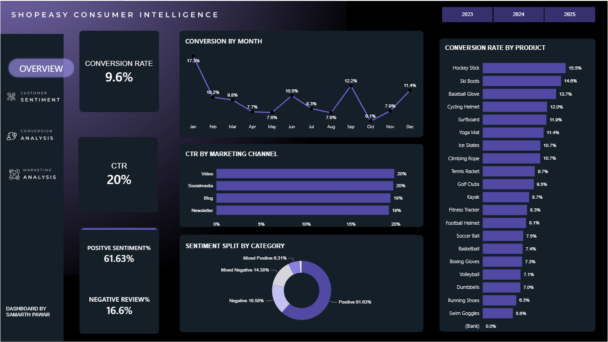
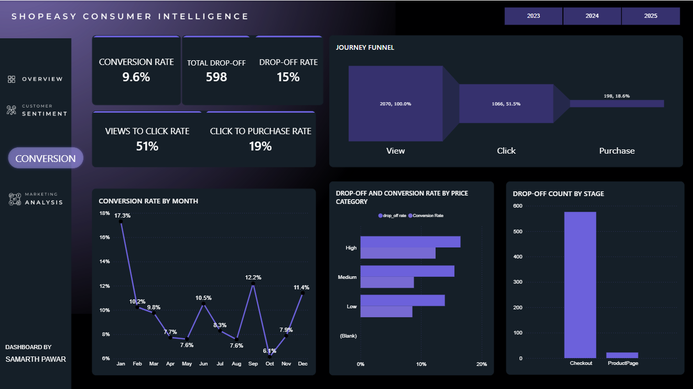
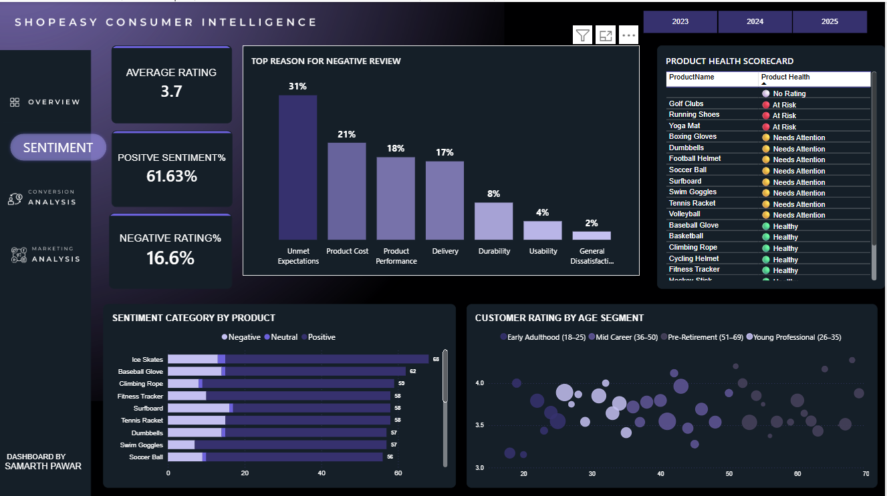
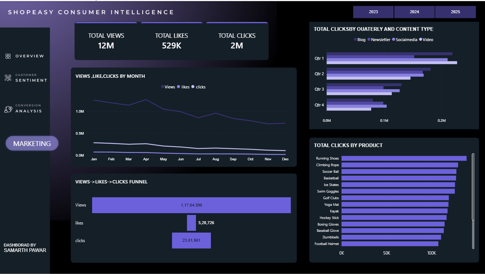

# Ecommerce Customer Behavior Analysis

## Introduction
ShopEasy is a fictional online retail company operating across multiple product categories. ShopEasy's leadership identified a gap between marketing investment and actual purchase conversion. Despite strong top-funnel engagement, revenue growth was not keeping pace with traffic. 
This analysis was commissioned to diagnose where customers were dropping off, why sentiment was declining, and which products were silently underperforming — before these issues became visible in the P&L.

## Problem Statement

Despite strong website traffic and customer engagement, sales growth is not meeting expectations. The objective of this project is to identify:

* Conversion bottlenecks in the customer journey
* Factors driving customer sentiment
* Product performance issues
* Opportunities to improve customer experience and revenue

## Dataset Overview

The analysis is based on three datasets:

1. Customer Journey Data – tracks customer interactions from product view to purchase.
2. Customer Review Data – contains customer ratings and review text.
3. Marketing Engagement Data – contains campaign performance metrics such as views, clicks, and likes.

## Tools and Technologies

* SQL Server
* Python
* Power BI

## Project Workflow

Raw Data → Data Validation → Data Cleaning → Sentiment Analysis → Dashboard Development → Business Recommendations

## Data Validation

Before performing any analysis, the datasets were validated to identify potential data quality issues that could affect the accuracy of the results.

The validation process focuses on checking:
- Duplicate records
- Missing values
- Inconsistent text formatting
- Invalid or unexpected values
- Data consistency across tables

This step ensures that the datasets are reliable before moving on to data cleaning and transformation.

## Data Cleaning & Transformation

After validating the datasets, data cleaning and transformation were performed to improve data quality and prepare the data for analysis.

The cleaning process includes:

* Removing logical duplicate records
* Standardizing text values and formatting
* Trimming unnecessary whitespace
* Splitting combined columns into meaningful attributes
* Preserving valid NULL values where they represent actual business events
* Creating cleaned datasets for further analysis in Python and Power BI

These transformations ensure consistency across the datasets and provide a reliable foundation for downstream analytics.

## Exploratory Data Analysis (EDA)

Before applying sentiment analysis, exploratory data analysis was performed to understand the structure and quality of the cleaned datasets.

The analysis focused on:

* Examining customer review data
* Understanding rating distributions
* Identifying missing values and text inconsistencies
* Exploring review lengths and common patterns
* Preparing the data for sentiment classification

This step provides a better understanding of the data and ensures it is suitable for further analysis using Python.

## Sentiment Analysis

Customer reviews were analyzed using Python to understand overall customer sentiment and identify how customers perceive different products and services.

The analysis includes:

* Classifying customer reviews into Positive, Neutral, and Negative sentiment
* Calculating sentiment scores for each review
* Preparing sentiment labels for business reporting and dashboard visualization

The processed sentiment data is exported for further analysis in Power BI.

## Processed Data Export

The sentiment analysis results were exported as structured datasets for further reporting and dashboard development.

The exported datasets include:

* **customer_reviews_sentiment.csv** – Contains customer reviews with sentiment scores and sentiment labels.
* **negative_reviews_issues.csv** – Contains categorized issues extracted from negative customer reviews for business analysis.

These processed datasets serve as the primary data source for the Power BI dashboard and business insights.

## Interactive Dashboard

An interactive Power BI dashboard was developed to transform the processed datasets into actionable business insights. The dashboard enables users to monitor customer behavior, conversion performance, customer sentiment, product health, and marketing effectiveness through an intuitive interface.

### Dashboard Features

The dashboard consists of four interactive pages:

- **Overview** – Presents key business metrics, conversion rate, sentiment distribution, and product performance.
- **Conversion Analysis** – Visualizes the customer journey, conversion funnel, and drop-off analysis.
- **Customer Sentiment** – Analyzes review sentiment, customer ratings, and reasons behind negative reviews.
- **Marketing Analysis** – Evaluates marketing engagement, campaign performance, and content effectiveness.

Interactive filters allow users to explore the data by year and other business dimensions.

## Dashboard Preview

### Overview

---

### Conversion Analysis

---

### Customer Sentiment

---

### Marketing Analysis

## Executive Summary

ShopEasy, a fictional e-commerce company, wanted to understand why strong customer engagement was not translating into higher sales. This project analyzes customer journey data, customer reviews, and marketing performance to uncover conversion bottlenecks, customer sentiment trends, and product performance insights.

Using SQL, Python, and Power BI, the data was validated, cleaned, analyzed, and transformed into an interactive dashboard that supports data-driven business decisions.

## Key Findings

- A significant percentage of customers dropped off during the checkout stage, indicating a potential issue in the purchase process.
- Most customer reviews expressed positive sentiment, while negative reviews highlighted recurring issues such as product quality and delivery experience.
- Certain products consistently outperformed others in customer ratings and engagement.
- Marketing campaigns generated strong engagement, but conversion rates varied across channels.

## Business Recommendations

Based on the analysis, the following recommendations are suggested:

- Optimize the checkout experience to reduce customer drop-offs.
- Address recurring issues identified in negative customer reviews.
- Focus marketing investment on campaigns with higher conversion performance.
- Monitor product sentiment regularly to identify quality concerns early.
- Continue using interactive dashboards for ongoing business monitoring.

